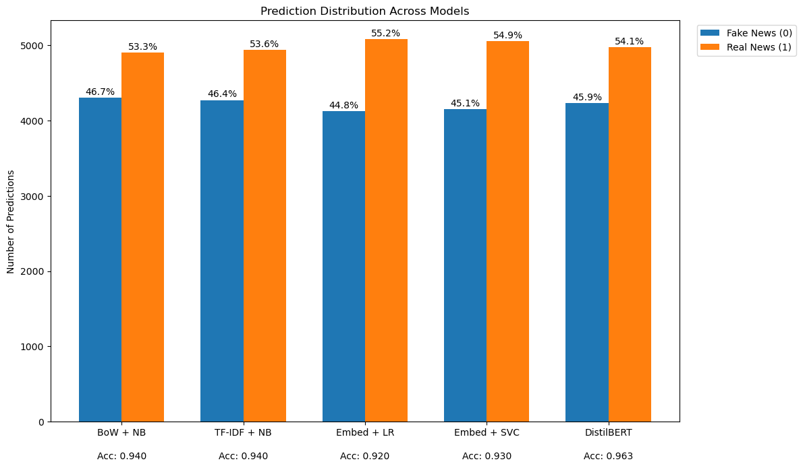

# Fake-news-detection-classical-to-transformer-nlp

## Group Project

This project explores multiple Natural Language Processing (NLP) approaches for fake news classification, ranging from classical Bag of Words and TF-IDF methods to sentence embeddings and transformer-based models such as DistilBERT.

---

# Team Members

| Member | Model Focus | GitHub |
|---|---|---|
| Alan An Jung Wei | --- | [alananjungwei](https://github.com/alananjungwei) |
| Laxmi Gupte | --- | [laxmigs24](https://github.com/laxmigs24) |
| Nicole Segura | --- | [nicolesegura121](https://github.com/nicolesegura121) |

---

# Objectives

- Build a fake news classifier
- Compare classical NLP and transformer approahces
- Evaluate multiple machine learning models 
- Perform inference on unseen news data (the testing dataset)
- Analyze model performance and prediction behaviour

---

# Dataset

The dataset consists of news headlines/articles labeled as:
- 0 → fake news
- 1 → real news

The testing dataset contained placeholder labels (2), which were replaced using model predictions.

---

# Workflow Overview 
I improved the CNN architecture through multiple experiments, with step-by-step optimization.


# Data Cleaning Section 


# Classical NLP Section 


# Embedding Section 
Embeddings are dense vector representations produced after a parameterization with pretrained model weights. In this work, we explore the effect of embeddings to expand the semantical relation of the training data with a classical NLP pipeline.


# Transformer Section 

Models were sourced from the Hugging Face portal, and the main parameters for choice were: small parameter size (< 6 billion), and most downloaded models. 
Model 1: 
Model 2: 
Model 3: The Roberta Fake News Detector model is a fine-tuned version of the "Fake-News-Bert-Detect" model, trained by 8000 news articles from the https://euvsdisinfo.eu/ portal. The model uses only 512 words, making it ideal for a dataset of headlines. 

# Hyperparameter Tuning 

Grid search from Scikit-learn was used to find the best combination of parameters for the classifier.  

# Results Table 

| Model | Main Change | Accuracy | Precision | Recall | F1-Score |
|---|---|---|---|---|---|
| BOW + MultinomialNB | default| 0.93 | 0.93 | 0.94 | 0.93 | 
| BOW + MultinomialNB | n_gram (1, 2), max_df = 0.95, min_df = 2, max_features = 10000 | 0.93 | 0.93 | 0.93 | 0.93 | 
| BOW + MultinomialNB| n_gram (1, 2), max_df = 0.99, min_df = 1, max_features = 50000 | 0.94 | 0.94 | 0.94 | 0.94 | 
| BOW + MultinomialNB | n_gram (1, 2), max_df = 0.95, min_df = 2, max_features = 50000| 0.94 | 0.94 | 0.94 | 0.94 | 
| TF-IDF + MultinomialNB | n_gram (1, 2), max_df = 0.95, min_df = 2, max_features = 20000 | 0.93 | 0.93 | 0.94 | 0.93 | 
| TF-IDF + MultinomialNB | n_gram (1, 3), max_df = 0.95, min_df = 2, max_features = 50000 | 0.94 | 0.94 | 0.94 | 0.94 | 
| Sentence Transformer + Logistic Regression | default | 0.92 | 0.91 | 0.93 | 0.92 | 
| Sentence Transformer + Logistic Regression | C = 10 | 0.92 | 0.91 | 0.93 | 0.92 | 
| Sentence Transformer + LinearSVC| default | 0.93 | 0.91 | 0.94 | 0.93 | 
| Sentence Transformer + LinearSVC| C = 10 | 0.92 | 0.91 | 0.94 | 0.93 | 
| Sentence Transformer + LinearSVC| C = 100 | 0.92 | 0.91 | 0.94 | 0.93 | 
| DistilBERT | default | 0.9618 | 0.9474 | 0.9784 | 0.9626 |
|SVC+TF-IDF | Baseline| 0.82|0.93 |0.91 |0.92 |
|SVC+TF-IDF | n_grams(1,2), max_df = 80%| 0.935|0.95 |0.92 |0.93 |
|SVC+TF-IDF | n_grams(1,2), min_df = 3| 0.936|0.95 |0.92 |0.93 |
|SVC+TF-IDF | n_grams(1,2), min_df = 3, SVC(C=10,gamma=1, Kernel="linear")| 0.923|0.93 |0.91 |0.92 |
|SVC+Qwen3(embedding) | n_grams(1,2), min_df = 3, SVC(C=10,gamma=1, Kernel="linear")| 0.916|0.92 |0.91 |0.92 |
|SVC+BGEsmallv1.5(embedding) | n_grams(1,2), min_df = 3, SVC(C=10,gamma=1, Kernel="linear")| 0.917|0.92 |0.91 |0.92 |
|RoBerta-Fake-NewsDetector | Fine Tuned with Trainer| 0.966|0.97 |0.96 |0.97 |
| Logistic Regression + BoW    | CountVectorizer with BoW features               | 0.92| 0.92 | 0.92 | 0.92 |
| Logistic Regression + TF-IDF | TF-IDF vectorization with n-grams               | 0.92 | 0.92 | 0.92 | 0.92 |
| Random Forest + BoW          | Baseline Random Forest classifier               | 0.85 | 0.85 | 0.84 | 0.84 |
| GridSearch RF + BoW          | Random Forest tuned using GridSearchCV          | 0.90 | 0.90 | 0.90 | 0.90 |
| Advanced Randomized RF + BoW | Random Forest tuned using RandomizedSearchCV    | 0.92 | 0.92 | 0.92| 0.92 |
| BiLSTM (Trainable Embedding) | Keras Embedding + BiLSTM architecture           | 0.93 | 0.93 | 0.93 | 0.93 |
| BiLSTM + GloVe Embedding     | Pretrained GloVe embeddings with BiLSTM         | 0.93 | 0.93| 0.93 | 0.93 |
| BERT Tiny Transformer        | Lightweight transformer-based transfer learning | 0.96 |0.96 | 0.96 | 0.96 |

---

## How to Add Precision and Recall

For every model, copy the values directly from:

```python
print(classification_report(y_valid, y_pred))
```

Use:

* weighted avg precision → Precision column
* weighted avg recall → Recall column

This keeps the table academically correct and consistent with your F1-score values.

## Classical NLP
* Bag of Words (BOW) + MultinomialNB Classifier 
* TF-IDF + MultinomialNB Classifier 
## Embeddings
* SentenceTransformer (Model: all-MiniLM-L6-v2) + LogisticRegression Classifier
* SentenceTransformer (Model: all-MiniLM-L6-v2) + LinearSVC Classifier
## Transformer 
* DistilBERT (Distilbert-base-uncased)

# Visualization Section 




# Conclusions 
